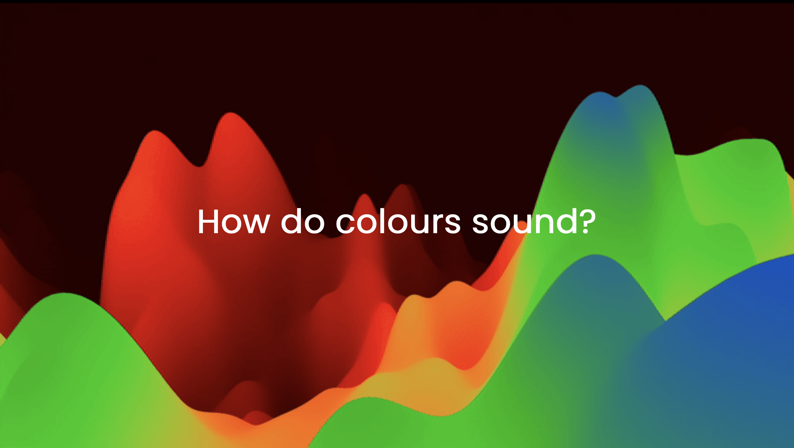

# ACTAM-Project

    

    At this link you can try the app:
  <a href="https://annafusari.github.io/itsNotGarageBand/">click and try (DA METTERCI IL LINK GIUSTO!)</a>

## Group:

- ####  Francesca Benesso &nbsp;([@fr-bn](https://github.com/fr-bn))  10700542 &nbsp;&nbsp; francesca1.benesso@mail.polimi.it

- ####  Filippo Marri &nbsp;([@filippomarri](https://github.com/filippomarri))  11010508&nbsp;&nbsp; filippo.marri@mail.polimi.it

 

  

 

### About the project
The aim of the project is to create an application able to simulate the effect that a person who has chromaesthesia experiments when is watching at an image. Actually, the proper chromaesthesia follows the inverse path: sounds are associated to colours and not vice-versa, but we tried to see what happens by reversing the pathway. The project is based upon the studies made by Aleksandr Nikolaevič Skrjabin and Vasilij Vasil'evič Kandinskij, two artists both with synaesthesia who have examined this idiosyncrasy from different points of view. The former focused his attention on pitch trying to create a formal relation between the circle of fiths and the main colours of the raimbow, while the latter devoted his studies on the relation between colours and intruments's timbre. Drewing ispiration from their results, we tried to merge the two theories with an algorithm that associates a speficic pitch (according to Skrjabin) and a peculiar timbre (according to Kandinskj) to the colours of an image.

 

### How does the algorithm work
The image is divided into blocks and the "averaged colour" of each block is stored inside a matrix. The averaged colour of one block is evaluated by averagin the values of the RGB components of each pixel contained in the block. So each element of the matrix will contain three pieces of data: red, green and blue. By pushing the button play, the columns of the matrix are read in sequence while all the rows of a same column are played togther. The sound are produced by activating oscillators in different configurations.
 

  

 

### How to use the app
- **Introduction:** press everywhere on the screen to skip the first three introduction pages.
- **Upload an image:** press on the upload button and choose the image you want to hear.
- **Play:** choose the speed by using the slider and press play.

### Technologies and libraries
- We imported the open-source Poppins font from Google Libraries. This font recalls the one used in web applicaations.
- We imported also the libraries jQuery and jsDeliver to write the function that creates the circular animation when we turn the page. The first library is simply a set of functions pre-written to simplify some opeartions related to effects. The second one is a library the allows us to minimise the file loaded from other sites. In this way, the loading time becomes shorter.
- Last but not least, we have imported a module containing all the sound we need for our project. We get it from the library Skypack, an open-source library whose elements are optimised for browser use.

### Project-related challenges
The biggest challenge we had to face was the one related to the computational burden of the alghorithm. Each time we increment the time variable we call a functions for each row of the matrix in which the picture is decomposed to evaluate the colours contained in the block identified by the row and the time instant that correspodns to the column of the matrix. After that we call other functions to play the sounds. This make the alghorithm very heavy. We tried to solve this problem by splitting the playing operation in two distinct ones. First, we create a proper matrix that contains all the infromation to "play the image" and then we call the functions to play the information contained in the matrix. In this way the application can play without crashing.